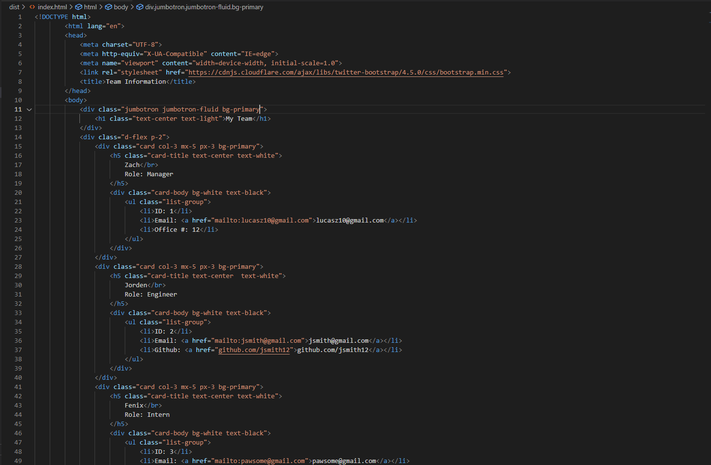

# Team-Info-HTML-Generator 
## Description

This is an application that is run in the console locally. The user will be inquired about various employees on their team and create an HTML file showcasing employees and their roles

## Table of Contents

  * [Installation Instructions](#installation-instructions)
  * [Usage](#usage)
  * [Contribution Guidelines](#contribution-guidelines)
  * [Testing Instructions](#testing-instructions)
  * [Questions](#questions)
  * [Licenses](#licenses)

## Installation Instructions

1. Install node.js on your local device 
2. Clone this repository to your local device. 
3. Run the application through your terminal (i.e. type 'node index.js' in the command window

## Usage

This application will ask a series of questions, starting with questions building a manager, and proceed to ask if there's additional employees. If the user selects 'yes', they will be prompted to specifiy if the new employee is an engineer or intern. Once the user has added all employees, the program will generate an HTML file in the dist folder and terminate.

## Contribution Guidelines

Please create a branch and create a pull request with a detailed description of any changes made to the repository.

## Testing Instructions

There are unit tests included in the _tests_ folder. Go to your terminal and type 'npm test {unit test file}'. These tests are operated using the jest api.

## Questions

  * You can view my GitHub profile [Here](https://github.com/lucasz10)
  * For additonal questions you can send me an [email](mailto:lucas.zach10@gmail.com)

## Sample Generated HTML Screenshot

## Demonstration Video

You can find a sample video [here](youtube.com)
